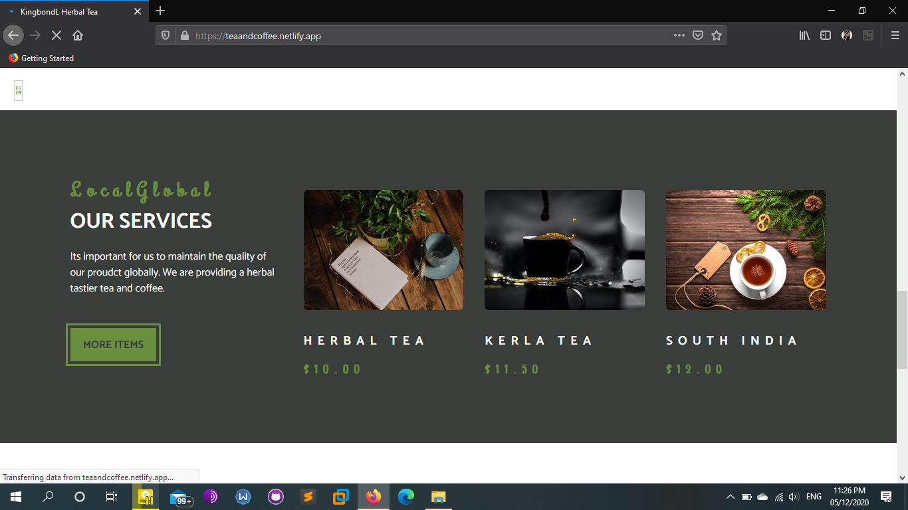
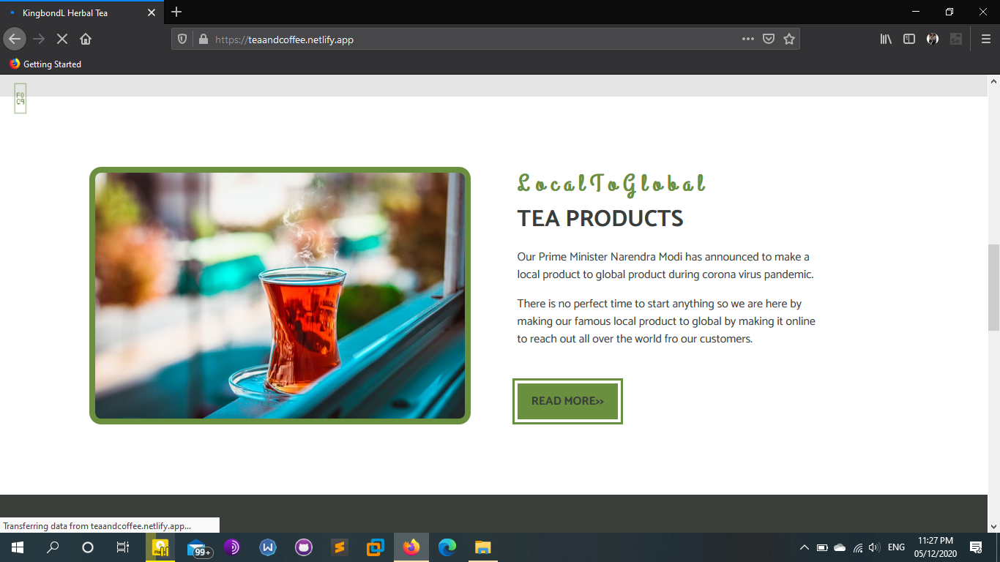

# Herbal-Tea-Website

It will show the basic info of herbal tea.Herbal teas have existed for a very long time, but have surged in popularity over the past several decades thanks to their vibrant flavor, as well as their myriad mental, emotional, and physical health benefits. In an increasingly stressful and chaotic world, herbal teas present an opportunity to go back to basics and focus on wellness through a holistic approach.  Because they can be created from almost any combination of natural ingredients, there are a vast number of herbal tea varieties Each with their own flavor qualities and health benefits. Some of the most common herbal teas include:  Chamomile tea Hibiscus tea Peppermint tea Red rooibos tea Turmeric tea Spearmint tea Ginger tea Yerba maté Herbal teas are most commonly consumed hot, but they can also be chilled and served over ice, depending on your preferences.

Webite Link - https://teaandcoffee.netlify.app/
